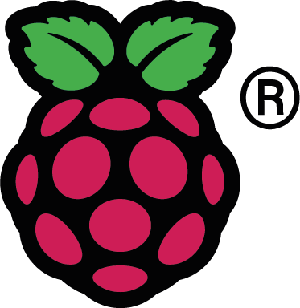

# Raspberry Pi Zero W Bluetooth Speaker Adapter Yocto Project

 

[Yocto Project](https://github.com/yoctoproject/poky) setup for Docker simple to build and use.

## Usage Guidelines

Built distributive flashed on SD Card will provide Bluetooth adapter functionality. Routing sound from Bluetooth connected device to a speaker connected to Raspberry Pi board.

To establish Bluetooth connection physical button could be installed between pins **7** and **9**. Once the button is clicked **bta** device become discoverable and could be paired.

By default HDMI is used as sound output.


## Development Guidelines

Docker Compose configured so it creates Debian container with all dependencies needed for poky, creates new volume for **build** directory and mounts **src** folder inside the container.

To build container run:
```
docker-compose up --build
```

To run bash terminal in container execute:
```
docker-compose run --rm yocto
```
where **yocto** is Docker image name


### Inside Container

Home directory contains following folders:

- ~/poky/ - poky source code
- ~/build/ - bit-bake build output
- ~/src/ - current poject source files
- ~/meta-*/ - Raspberry Pi and Open Embedded meta layers

To build final linux distributive two following commands need to be executed:

1. For initial configuration run following script, needs to be executed only once on first setup, adds meta layers to bit-bake:
```
~/scripts/init.sh
```

2. To apply latest updates and build the project run, needs to be rerun on every configuration or recipes change:
```
~/scripts/build.sh
```

Final image could be located in: **~/build/tmp/deploy/images/raspberrypi0-wifi/**


### SD Card Flashing

#### On Linux

Check connected drives using command:
```
lsblk
```

Lets suppose that our SD Card name is discovered as **sdb** if it has partitions mounted they will be names sdb1, sdb2 and so on, they might need to be unmounted prior flashing.

To unmount partition sdb1 use command:
```
umount /dev/sdb1
```

To flash image to SD Card cd to **~/build/tmp/deploy/images/raspberrypi0-wifi/** and execute command:
```
sudo bmaptool copy core-image-base-raspberrypi0-wifi.wic.bz2 /dev/sdb
```

Where **core-image-base-raspberrypi0-wifi.wic.bz2** is image name and **/dev/sdb** is SD Card path.

The flashing utility will partition SD Card and write system files on it.

#### On Mac

Use **balenaEtcher** for simple GUI or terminal:

Check connected drives using command:
```
diskutil list
```

Lets suppose that our SD Card name is discovered as **disk2** if it has partitions mounted they will be names disk2s1, disk2s2 and so on, they might need to be unmounted prior flashing.

To unmount partition disk2 use command:
```
sudo diskutil unmountDisk /dev/disk2
```

To flash image to SD Card cd to **~/build/tmp/deploy/images/raspberrypi0-wifi/** and execute command:
```
bzip2 -dkc "$(readlink ./core-image-base-raspberrypi0-wifi.wic.bz2)" | sudo dd bs=1m of=/dev/disk2
```

For progress bar install pv with **brew install pv** and use following command:
```
bzip2 -dkc "$(readlink ./core-image-base-raspberrypi0-wifi.wic.bz2)" | sudo dd bs=1m | pv | sudo dd bs=1m of=/dev/disk2
```

Where **core-image-base-raspberrypi0-wifi.wic.bz2** is image name and **/dev/disk2** is SD Card path.

The flashing utility will partition SD Card and write system files on it.

### Debug

To ssh through usb use following command, password **pass**, (disabled in local.conf by default):
```
ssh root@bta.local
```
or
```
ssh pri@bta.local
```
